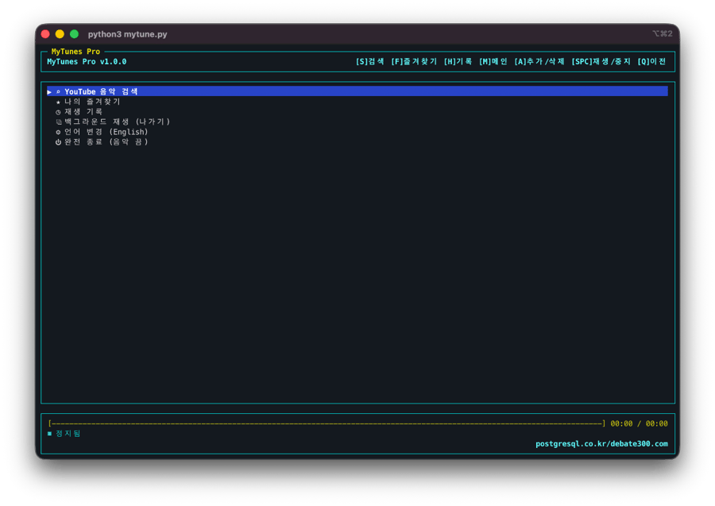
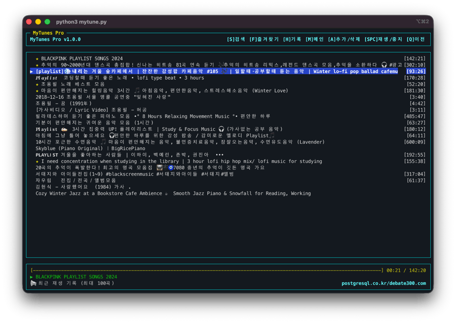
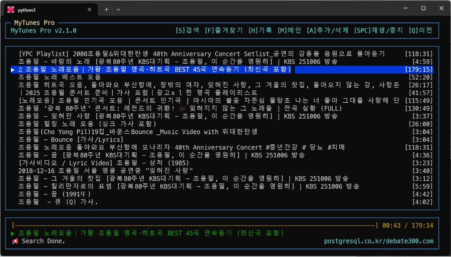
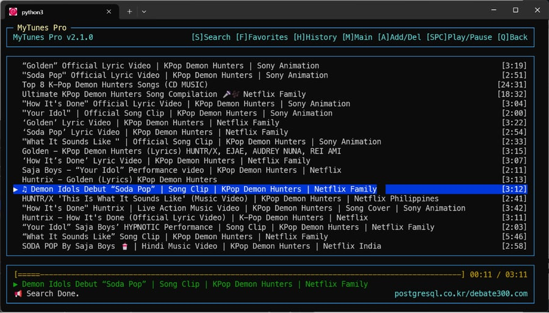

# 🎵 MyTunes Pro (Korean)

**현대적인 CLI 유튜브 뮤직 플레이어 (v1.0.0)**  
터미널 환경에서 **YouTube 음악을 검색하여 듣는** 가볍고 빠른 키보드 중심의 플레이어입니다.  
한국어 입력 환경에서도 **숫자 키(1~5)**를 통해 지연 없는 쾌적한 조작이 가능합니다.

> **💡 개발 배경**  
> 이 프로그램은 하루 종일 터미널을 보는 개발자들이 **작업 흐름을 끊지 않고** 편하게 음악을 듣기 위해 만들어졌습니다.  
> 특히 **모니터가 없는(Headless) 미니 PC (Debian Server)**를 거실이나 책상의 '뮤직 스테이션'으로 활용하고자 했던 개인적인 필요에서 시작되었습니다.  
> 복잡한 설정 없이, 터미널 하나만 있으면 어디서든 당신만의 오디오 플레이어가 됩니다.


## 📸 Screenshots
| | |
| :---: | :---: |
|  |  |
|  |  |

---

## ✨ 주요 기능

- **강력한 검색**: `yt-dlp` 엔진을 사용하여 광고 없는 고음질 오디오 스트리밍.
- **쾌적한 조작**: `curses` 기반 TUI로 빠르고 직관적인 인터페이스.
- **연속 재생**: 한 곡이 끝나면 **리스트의 다음 곡을 자동으로 재생**합니다.
- **이어듣기**: 중단된 위치부터 **이어서 재생**할지 선택할 수 있습니다.
- **한글 최적화**: 한글 자소 조합 대기 시간 없이 즉시 반응하는 **숫자 단축키** 지원.
- **스마트 기능**: 즐겨찾기, 재생 기록(최대 100곡), 자동 음악 필터링 검색.
- **비주얼**: 현대적인 심볼 아이콘(⌕, ★, ◷)과 깔끔한 디자인.

## 🛠 필수 요구사항 (Prerequisites)

이 프로그램은 오디오 재생을 위해 **mpv**와 검색을 위해 **yt-dlp**가 시스템에 설치되어 있어야 합니다.

### macOS
Homebrew를 사용하여 간단히 설치할 수 있습니다.
```bash
brew install mpv yt-dlp python3
```

### Linux (Ubuntu/Debian)
```bash
sudo apt update
sudo apt install mpv python3-pip
pip3 install -U yt-dlp
```

### Windows
Windows 환경에서는 **WSL (Windows Subsystem for Linux)**을 설치하여 Ubuntu 환경에서 실행하는 것을 권장합니다.
WSL 터미널에서 위 Linux 설치 방법을 따르세요.

---

## 🚀 설치 및 실행 (Installation)

1. **저장소 다운로드**
   ```bash
   git clone https://github.com/postgresql-co-kr/mytunes.git
   cd mytunes
   ```

2. **가상환경 설정 (권장)**
   ```bash
   python3 -m venv venv
   source venv/bin/activate
   ```

3. **라이브러리 설치**
   ```bash
   pip install -r requirements.txt
   ```

4. **실행**
   ```bash
   python3 mytune.py
   ```

### 💡 꿀팁: 단축어로 실행하기
매번 `source venv/...` 입력이 귀찮다면 **가상환경 파이썬 경로**를 직접 지정하여 단축어(Alias)를 만드세요.

```bash
# 예시: 가상환경(venv) 내의 파이썬으로 직접 실행 (별도 activate 불필요)
alias mp="~/workspace/mytunes/venv/bin/python3 ~/workspace/mytunes/mytune.py"
```
설정(`~/.zshrc`) 저장 후 터미널을 재시작하면, 언제든 `mp` 입력만으로 실행됩니다.

---

## ⌨️ 조작 방법 (Controls)

**MyTunes Pro**는 키보드만으로 모든 기능을 제어합니다.  
한글 입력 상태에서도 끊김 없는 조작을 위해 **숫자 단축키** 사용을 권장합니다.
(한글 입력 중에는 알파벳 단축키가 즉시 인식되지 않을 수 있으므로, 숫자키나 Enter를 활용하세요.)

### ⚡️ 즉시 반응 단축키 (숫자키)
한영 전환 없이 언제든 누르면 즉시 실행됩니다.

| 키 | 기능 | 설명 |
| :--- | :--- | :--- |
| **`1`** | **검색 (Search)** | 음악 검색창 열기 (단축키 `S`와 동일) |
| **`2`** | **즐겨찾기 (Fav)** | 저장된 즐겨찾기 목록 보기 (단축키 `F`와 동일) |
| **`3`** | **기록 (History)** | 최근 재생한 100곡 보기 (단축키 `H`와 동일) |
| **`4`** | **메인 (Main)** | 메인 화면으로 돌아가기 (단축키 `M`과 동일) |
| **`5`** | **추가/삭제** | 선택한 곡 즐겨찾기 토글 (단축키 `A`와 동일) |
| **`0`** | **뒤로가기** | 이전 화면으로 이동 (단축키 `Q`의 안전 모드) |

### 🧭 기본 탐색
| 키 | 동작 |
| :--- | :--- |
| `↑` / `↓` | 리스트 위/아래 이동 |
| `Enter` | **선택 / 재생** (한글 모드에서도 확실하게 동작) |
| `Space` | 재생 / 일시정지 (Play/Pause) |
| `Backspace` | 뒤로 가기 / 검색어 지우기 |

---

## 📂 데이터 저장
- 즐겨찾기와 재생 기록은 홈 디렉토리의 `~/.pymusic_data.json` 파일에 영구 저장됩니다.
- 프로그램 종료 후 다시 실행해도 데이터가 유지됩니다.

---
---

# 🎵 MyTunes Pro (English)

**Modern CLI YouTube Music Player (v1.0.0)**  
A lightweight, keyboard-centric terminal player for streaming YouTube music.  
Designed for speed and efficiency, with optimized controls for international keyboard imports.

> **💡 Preface**  
> This project was created to give developers a seamless way to enjoy music without leaving their terminal environment.  
> It basically started from a personal need to turn a **headless mini-PC running Debian Server** into a dedicated living room music station (with no monitor or GUI).  
> Just bring your terminal, and you have a full-featured audio player.

## ✨ Key Features
- **Powerful Search**: High-quality audio streaming via `yt-dlp`.
- **Sequential Play**: Automatically plays the next song in the list.
- **Smart Resume**: Option to resume playback from where you left off.
- **Fast TUI**: Responsive `curses` interface.
- **Smart Shortcuts**: Instant number keys (1-5) for quick navigation.
- **Visuals**: Clean aesthetic with system-style glyphs (⌕, ★, ◷).

## 🛠 Prerequisites

### macOS / Linux
Requires **mpv** and **yt-dlp**.


### Windows
We recommend using **WSL (Windows Subsystem for Linux)** to run this application in an Ubuntu environment.
Simply follow the Linux installation steps inside your WSL terminal.

## 🚀 Installation & Run

1. **Clone Repository**
   ```bash
   git clone https://github.com/postgresql-co-kr/mytunes.git
   cd mytunes
   ```

2. **Setup Virtual Environment (Recommended)**
   ```bash
   python3 -m venv venv
   source venv/bin/activate
   ```

3. **Install Dependencies**
   ```bash
   pip install -r requirements.txt
   ```

4. **Run**
   ```bash
   python3 mytune.py
   ```

### 💡 Tip: Run with Alias
You can run the app without activating venv manually by pointing to the **virtualenv python executable**.

```bash
# Example: Use python specific to the venv (No manual activate needed)
alias mp="~/workspace/mytunes/venv/bin/python3 ~/workspace/mytunes/mytune.py"
```
Add to shell config (`~/.zshrc`), restart terminal, and simply type `mp` to run.

## ⌨️ English Controls

### ⚡️ Instant Shortcuts (Number Keys)
Works instantly regardless of input method.

| Key | Function | Description |
| :--- | :--- | :--- |
| **`1`** | **Search** | Open search prompt (Same as `S`) |
| **`2`** | **Favorites** | View favorites list (Same as `F`) |
| **`3`** | **History** | View playback history (Same as `H`) |
| **`4`** | **Main Menu** | Go to Main Menu (Same as `M`) |
| **`5`** | **Add/Del** | Toggle favorite status (Same as `A`) |
| **`0`** | **Back** | Go back (Same as `Q`) |

### 🧭 Navigation
| Key | Action |
| :--- | :--- |
| `↑` / `↓` | Move selection |
| `Enter` | Select / Play |
| `Space` | Play / Pause |
| `Q` | Go Back (Safe navigation) |
| `Backspace` | Go Back |

---

[postgresql.co.kr](https://postgresql.co.kr) / [debate300.com](https://debate300.com)
